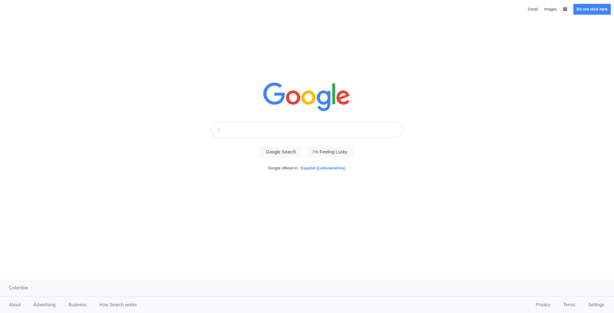

# Google Homepage

> Foundations - The Odin project

## Description

Build the Google homepage using HTML/CSS.

The objective is simple, have a page that looks the same as the real Google homepage.

## Technologies & Tools 💻

| Category    | Technology/Tool                                                                                                                                                                                                                                                                                                                                                                                                                |
| ----------- | ------------------------------------------------------------------------------------------------------------------------------------------------------------------------------------------------------------------------------------------------------------------------------------------------------------------------------------------------------------------------------------------------------------------------------ |
| `Frontend`  |                                                                                                  |
| `Editors`   |                                                                                                                                                                                                                                                         |
| `Utilities` |    |

## Live demo

> Google homepage.

[Google Homepage](https://diegozencode.github.io/google-homepage)

---

## Project Notes

- Use HTML & CSS
- Simple HTML Structure
- Work with classes and IDs

---

## Author

- **Diego Monroy** (@diegozencode) -  |
   |
  
